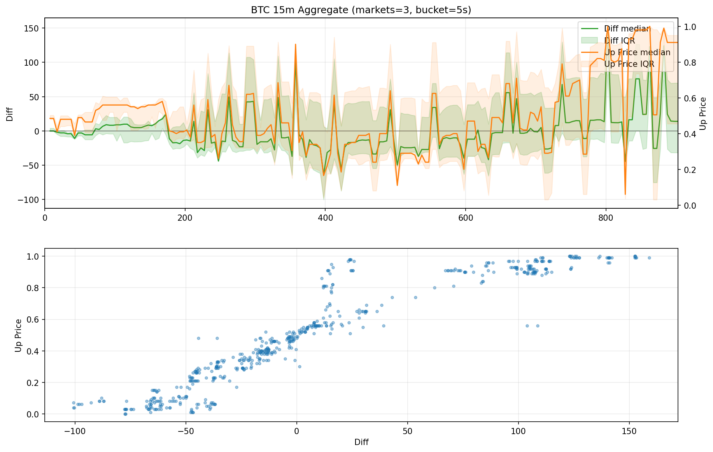
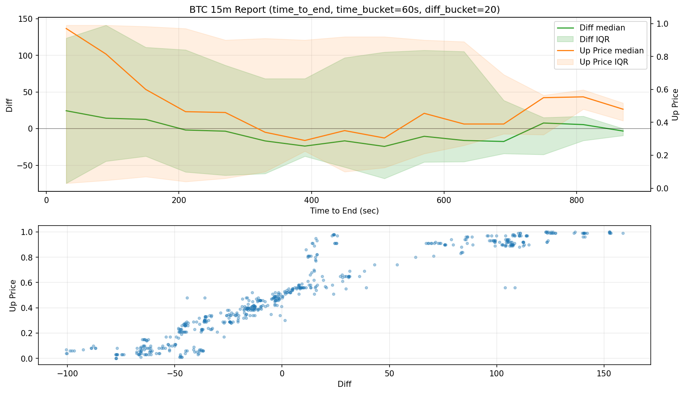
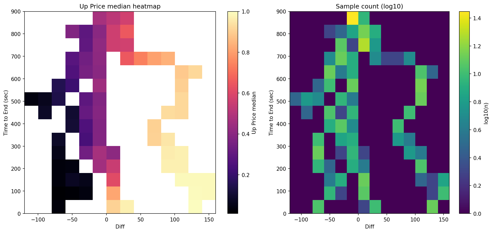
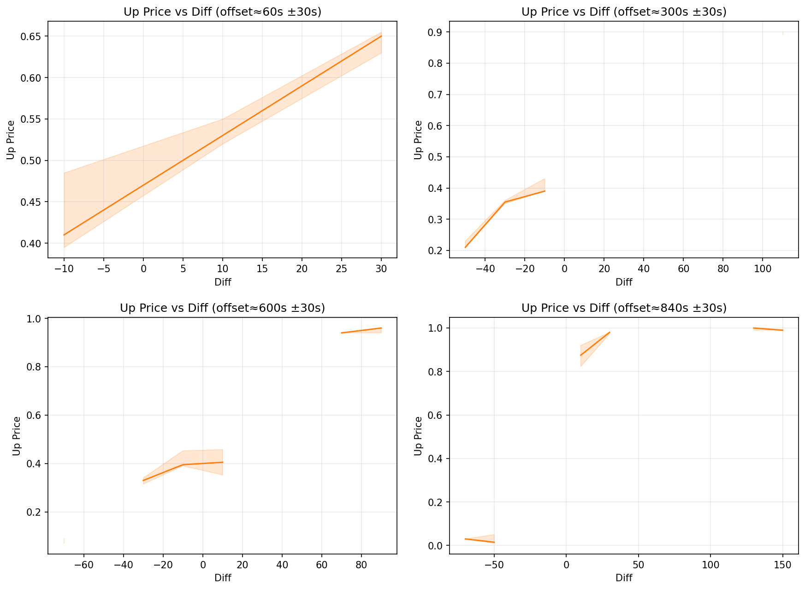
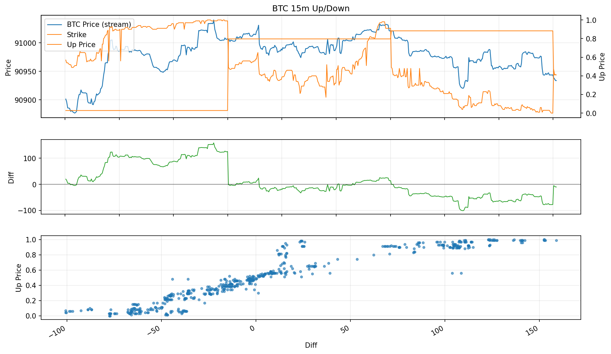

# Polymarket 15m Up-Down 监控

这个仓库主要用来监控 Polymarket 的 15 分钟 Up/Down 市场，并把每次轮询得到的数据持续写入 CSV。价格源使用 Chainlink Data Streams（stream），盘口使用 Polymarket CLOB（order book）。

目前支持币种：
- BTC
- ETH
- SOL
- XRP

## 环境要求

- Python 3.10+（建议 3.11/3.12）
- 依赖：`requests`（脚本使用标准库 + requests）

安装依赖：

```bash
pip install requests
```

## 主要脚本

### 1 监控脚本（推荐）

文件：[monitor_polymarket.py](https://github.com/weiuou/polymarket_15minupdown_monitor/blob/main/monitor_polymarket.py)

启动监控（只需要填币种）：

```bash
python monitor_polymarket.py --slug btc
python monitor_polymarket.py --slug eth
python monitor_polymarket.py --slug sol
python monitor_polymarket.py --slug xrp
```

运行逻辑：
- 主循环会自动轮转到“当前 15 分钟窗口”的市场 slug（例如 `xrp-updown-15m-<ts>`）
- Chainlink 价格由后台线程采集并缓存，主循环直接读取缓存
- 每次 Chainlink cache 新增数据会触发 CSV 回填（修正历史行并重算 Diff），这保证了即使没有chainlink stream亚秒级的数据流（需要花钱）也能保证数据的最终一致性，这对于分析并制定做市策略有一定帮助

## CSV 输出

每个币种输出一个 CSV（脚本自动创建）：
- `polymarket_btc_15m.csv`
- `polymarket_eth_15m.csv`
- `polymarket_sol_15m.csv`
- `polymarket_xrp_15m.csv`

CSV 表头（固定 10 列）：
- `Timestamp`：写入时间（UTC，ISO8601）
- `Time_Left_Sec`：距离到期秒数（可能为负，表示已到期）
- `Price_Stream`：来自 Chainlink stream 的价格（对应币种）
- `Strike_Price`：开盘定值（来自 stream，按 slug 时间点取值）
- `Diff`：`Price_Stream - Strike_Price`（保留 2 位小数）
- `Up_Price`：Polymarket “Up/Yes” 的价格（来自 Gamma/CLOB，CLOB 优先）
- `Best_Bid`：CLOB 最优买价
- `Best_Ask`：CLOB 最优卖价
- `Extra`：预留字段（目前为空；用于兼容/扩展）
- `Slug`：该行对应的市场 slug


## 统计图表绘制

使用脚本 [plot_polymarket_csv.py](https://github.com/weiuou/polymarket_15minupdown_monitor/blob/main/plot_polymarket_csv.py) 把 CSV 生成 PNG 图表，方便做统计分析。

### 依赖安装

```bash
pip install matplotlib numpy
```

### 一键默认命令（推荐）

只想“不要参数地先跑起来”，直接用 preset：

```bash
python plot_polymarket_csv.py --csv polymarket_btc_15m.csv --preset report
python plot_polymarket_csv.py --csv polymarket_btc_15m.csv --preset aggregate
python plot_polymarket_csv.py --csv polymarket_btc_15m.csv --preset single
```

- `--preset report`：一个 CSV 输出 3 张统计图（时间统计 / 热力图 / 切片曲线）
- `--preset aggregate`：把最近多个 15min 市场对齐后做聚合曲线（适合“同类市场不混乱地画在一张图里”）
- `--preset single`：画 CSV 最近一段时间的时间序列（默认 `tail=600`）

### 运行效果参照（示例 PNG）

下面这些图是用仓库里现成的 `polymarket_btc_15m.csv` 生成的，方便你对照自己的运行输出是否正常。

聚合视图：

```bash
python plot_polymarket_csv.py --csv polymarket_btc_15m.csv --preset aggregate
```



报表视图（3 张）：

```bash
python plot_polymarket_csv.py --csv polymarket_btc_15m.csv --preset report
```







单市场时间序列：

```bash
python plot_polymarket_csv.py --csv polymarket_btc_15m.csv --preset single
```



### 模式 1：单市场时间序列（绝对时间轴）

适合查看“最近一段时间”的实际走势（Price/Strike/Diff/Up Price）。

```bash
python plot_polymarket_csv.py --csv polymarket_btc_15m.csv --tail 600
```

输出：默认生成同名 PNG，例如 `polymarket_btc_15m.png`。

常用参数：
- `--tail N`：只画最后 N 行（建议配合监控持续运行的数据使用）
- `--slug <event-slug>`：只画某一个具体市场（精确匹配 CSV 的 `Slug` 列）
- `--out <path.png>`：指定输出路径

### 模式 2：聚合视图（按 15min 市场对齐）

适合回答“同一类市场（每 15min 一个新 strike）里，Diff 对 Up Price 的影响是什么”。

对齐方式：
- 横轴是 `offset_sec = RowTimestamp - slug_ts`，表示距离该 15min 市场开始过了多少秒（0~900）
- 纵轴同时画 `Diff`（左轴）和 `Up Price`（右轴），下方提供 `Diff vs Up Price` 的密度/散点分布

```bash
python plot_polymarket_csv.py --csv polymarket_btc_15m.csv --mode aggregate --markets 128 --bucket-sec 5
```

输出：默认生成 `*_agg.png`，例如 `polymarket_btc_15m_agg.png`。

常用参数：
- `--markets N`：选取最近 N 个 15min 市场（按 slug_ts 排序）
- `--bucket-sec S`：按 S 秒分桶做统计（越大越平滑，但细节越少）
- `--min-market-points K`：剔除点数过少的市场（避免单个市场噪声影响统计）
- `--min-bucket-samples K`：单个分桶内样本少于 K 则不画（减少“偶然点”导致的抖动）
- `--gap-fill {none,ffill,linear}`：填补短缺口（默认不填；缺口过大依旧断开以免误导）
- `--gap-max-sec N`：只填补不超过 N 秒的缺口

推荐：曲线更连续但不过度“硬连”

```bash
python plot_polymarket_csv.py --csv polymarket_btc_15m.csv --mode aggregate --markets 256 --bucket-sec 5 --gap-fill ffill --gap-max-sec 20
```

说明：
- 绘图会自动过滤 `Strike_Price=no_price_data` 或 `Diff='-'` 的行
- 若聚合曲线出现断点，通常是某些时间桶没有样本（或被过滤），属于正常现象；可通过增大 `--markets` / `--bucket-sec` 或启用 `--gap-fill` 缓解

### 模式 3：报表统计（一个 CSV 输出多张图）

适合回答你提到的“同样 diff，不同时间位置对价格影响不同怎么展示”，会把数据按「时间桶 × diff 桶」做二维统计，并给出：
- `*_report_time.png`：按时间桶的 Diff/Up Price 中位数与 IQR（可选 time_axis）
- `*_report_heatmap.png`：Up Price 中位数热力图 + 样本数热力图
- `*_report_slices.png`：在若干个 offset 位置附近，画 Up Price vs Diff 的曲线切片

最简命令：

```bash
python plot_polymarket_csv.py --csv polymarket_btc_15m.csv --preset report
```

常用参数：
- `--time-axis {offset,time_to_end}`：时间轴是“距离开始”还是“距离结束”
- `--time-bucket-sec N`：时间分桶大小（默认 60）
- `--diff-bucket X`：diff 分桶大小（默认 20）
- `--slices 60,300,600,840`：在这些 offset 秒附近做切片曲线
- `--slice-window-sec 30`：切片窗口（±秒）
- `--min-bucket-samples K`：时间桶内样本少于 K 就不画（减少噪声）

时间轴理解：
- `offset`：从市场开始算起（0=开盘，900=到期）
- `time_to_end`：距离到期还有多少秒（900=开盘，0=到期）

## 常见问题

### 1 CSV 里为什么 Strike_Price 是no_price_data

这通常发生在已经开始的15min市场，但是stream并没有获取到开始时的价格数据，等到下一个15min市场开始就会正常显示了。

### 2 为什么 Diff 会“看起来不对”？

如果某一时刻写入时 strike 或 stream 点尚未就绪，可能先写入临时值或空值；后台线程会在后续 stream 更新时自动回填并重算 Diff，保证最终 CSV 一致。

### 3 为什么有的图看起来是“不连续”的

这是正常现象，通常是“某些时间段没有可用样本”导致的，常见原因有：

- 过滤导致：脚本会自动跳过 `Strike_Price=no_price_data` 或 `Diff='-'` 的行；这些点在图上就会形成空洞/断点
- 分桶过细：`aggregate/report` 都会按时间分桶（`--bucket-sec` 或 `--time-bucket-sec`），如果桶太细而样本又不够，某些桶会没有数据
- 降噪门槛：如果设置了 `--min-bucket-samples K`，当某个桶里样本数 < K 会被置空，以免“偶然点”把曲线拉歪
- 数据天然缺口：网络抖动/请求失败/程序暂停都会造成 CSV 某些区间没有写入行

如何缓解（按优先级）：

- 增大样本量：在聚合视图里把 `--markets` 调大（例如 256/512），让每个时间桶更容易有样本
- 调粗分桶：`--bucket-sec` 或 `--time-bucket-sec` 调大（例如 5→10/20，60→120），曲线会更连续但细节更少
- 允许短缺口“补齐”：启用 `--gap-fill ffill`（或 `linear`）并设置合适的 `--gap-max-sec`，只对短缺口做填补，避免误导性硬连
- 降低门槛：把 `--min-bucket-samples` 调小（例如 3→1），但噪声会增大

经验上：想要“更连续但不过度造假”，优先用 `--gap-fill ffill` + 小的 `--gap-max-sec`，并保证 `--markets` 足够大。

## 参考：FeedId

脚本内置映射（来自 Chainlink Data Streams 页面），这个来自polymarket的规则，如果后续上了新的15min市场可以从pm的规则中获取Chainlink相关的链接：
- BTC：`0x00039d9e...75b8`
- ETH：`0x00036220...3ae9`
- SOL：`0x0003b778...c24f`
- XRP：`0x0003c16c...fc45`

